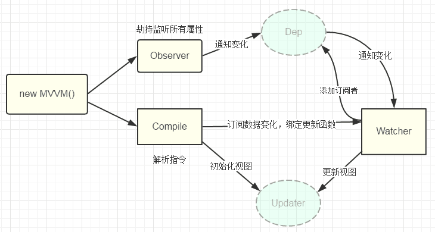

## vue2.x 响应式原理
vue2.x中的响应式原理是通过 Object.defineProperty 对 data 数据进行劫持，在首次获取 data 中的数据渲染视图时，开始收集视图中对 data 数据的依赖，在 data 发生变化时，通知对应视图重新渲染。涉及概念：数据劫持(Observe)，依赖收集器(Dep)，观察者(Watcher)，编译器(complier)。

## vue2.x 响应式原理流程
**上述提到的概念有可能是在同一个类中。**



1、vue 会初始化数据(这里不讨论 props, inject 等)，即对 data 数据进行劫持(new Observe(data))，并将整个 data 赋值给实例 vm(Vue实例化后的变量)

2、代理 vm 中的 data 数据，即访问 vm.a 等于访问 vm.$data.a

3、初始化编译器，对模板({{}})等进行处理，在此过种中，会读取 data 中的值。由于已经对 data 进行了劫持，在编译过程中，会先实例第一份依赖收集器，生成观察者(Watcher)，并将 Watcher 保存到依赖收集器势力的变量(是个数组)中。

4、data 中数据发生改变，此时，依赖收集器会读取所保存的观察者(观察者中就保留着以来视图，和更新视图的方法(update))，然后通知(notify)全部观察者(Watcher)去更新视图(update)

综上，依赖收集器(Dep)用来收集依赖(观察者 Watcher)并通知依赖去更新(update)，Dep 只是通知，并不处理视图更新逻辑。

**注：响应式原理和双向绑定是不太一样的，响应式原理是通过数据劫持，属于 vm 层去影响试图层(v)，是隐式的。双向绑定则是属性(props)和事件(emit)的语法糖，需要显式(v-model)去使用。**

## 乞丐版响应式原理
### Observe 的实现
```javascript
// observe.js
class Observe {
  constructor(data) {
    this.walk(data)
  }
  // 遍历 data 中的属性，递归找到全部的对象
  walk(data) {
     // 1. 判断data是否是对象
     if (!data || typeof data != 'object') {
      return
    }
    // 2. 遍历data对象的所有属性
    Object.keys(data).forEach(key => {
      this.defineReactive(data, key, data[key])
    })
  }
  // 劫持 data 数据
  defineReactive(obj, key, val) {
    let that = this
    // 如果val是对象，把val内部的属性转换成响应式数据
    this.walk(val)
    // 负责收集依赖，并发送通知
    // 每个 data 中的 key 都会有个独立的 dep
    let dep = new Dep()
    Object.defineProperty(obj, key, {
      enumerable: true,
      configurable: true,
      get () {
          // 收集依赖
          Dep.target && dep.addSub(Dep.target)
          return val
      },
      set (newValue) {
        if (newValue == val) {
            return
        }
        val = newValue
        that.walk(newValue)
        // 发送通知
        // 通知依赖中的 watcher 去更新视图
        dep.notify()
      }
    })
  }
}

class Dep {
  constructor() {
    // 存储所有的观察者
    this.subs = []
  }
  static target = null

  // 添加观察者
  addSub(sub) {
    if (sub && sub.update) {
      console.log('添加观察者')
      this.subs.push(sub)
    }
  }
  // 发送通知
  notify() {
    console.log('通知订阅')
    this.subs.forEach(sub => {
      sub.update()
    })
  }
}

export {
  Observe,
  Dep
}
```
### Watcher 的实现
```js
// watcher.js
import { Dep } from './observer.js'
class Watcher {
  constructor(vm, key, cb) {
    this.vm = vm;
    // key 是data中的属性名称
    this.key = key;
    // 回调函数负责更新视图
    this.cb = cb

    // 把 watcher 对象记录到 Dep 类的静态属性 target
    Dep.target = this
    // 触发劫持数据中的 get 方法，在 get 方法中会调用 dep.addSub
    // 这里若要能跑通，需要将劫持数据代理(proxy)到 vm 上
    // 也就是访问 vm 上的属性，实际访问的是劫持数据 data 上的属性
    this.oldValue = vm[key]
    
    Dep.target = null
  }

  // 当数据发生变化 的时候更新视图
  update () {
    let newValue = this.vm[this.key]
    if (this.oldValue == newValue) {
      return
    }
    this.cb(newValue)
  }
}

export {
  Watcher
}
```
### Complier 的实现
```js
// complier.js
import { Watcher } from './watcher.js'

class Compiler {
  constructor(vm) {
    this.el = vm.$el
    this.vm = vm
    this.compile(this.el)
  }
  // 编译模板，处理文本节点和元素节点
  compile(el) {
    let childNodes = el.childNodes
    Array.from(childNodes).forEach(node => {
      // 处理文本节点
      if (this.isTextNode(node)) {
        this.compileText(node)
      } else if (this.isElementNode(node)) {
        // 处理元素节点
        this.compileElement(node)
      }
      if (node.childNodes && node.childNodes.length) {
        this.compile(node)
      }
    })
  }
  // 编译元素节点，处理指令
  compileElement(node) {
    // 遍历所有的属性节点
    Array.from(node.attributes).forEach(attr => {
      // 判断是否是指令
      let attrName = attr.name
      if (this.isDirective(attrName)) {
        // 将 v-text --> text
        attrName = attrName.substr(2)
        let key = attr.value
        this.update(node, key, attrName)
      }
    })

  }

  update(node, key, attrName) {
    let updateFn = this[attrName + 'Updater']

    updateFn && updateFn.call(this, node, this.vm[key], key)
  }

  // 处理 v-text 指令
  textUpdater(node, value, key) {
    node.textContent = value
    new Watcher(this.vm, key, (newValue) => {
      node.textContent = newValue
    })
  }
  // 处理 v-model
  modelUpdater(node, value, key) {
    node.value = value
    new Watcher(this.vm, key, (newValue) => {
      node.value = newValue
    })
    node.addEventListener('input', () => {
      this.vm[key] = node.value
    })
  } 

  // 编译文本节点，处理差值表达式
  compileText(node) {
    let reg = /\{\{((?:.|\r?\n)+?)\}\}/
    let value = node.textContent
    if (reg.test(value)) {
      let key = RegExp.$1.trim()
      node.textContent = value.replace(reg, this.vm[key])
      // 创建 watcher
      new Watcher(this.vm, key, (newVal) => {
        node.textContent = newVal
      })
    }
  }

  // 判断元素属性是否是指令
  isDirective(attrName) {
    return attrName.startsWith('v-')
  }
  // 判断节点是否是文本节点
  isTextNode(node) {
    return node.nodeType == 3
  }
  // 判断节点是否是元素节点
  isElementNode(node) {
    return node.nodeType == 1
  }
}
export {
  Compiler
}
```
### proxy 的实现
proxy 用来代理 data 中的数据到 vm 实例上，这样访问 vm 实例时，实际上访问的是 data 中的数据。由于 data 已经通过数据劫持，所以直接访问 vm 上的数据也会触发数据劫持。
```js
// proxy.js
const noop = () => {}

const sharedPropertypeDefinition = {
    enumerable: true,
    configurable: true,
    get: noop,
    set: noop
}
// 通过重写 get 和 set 来获取和更改 data 中的内容
// 此 demo 中，target 就是 vm，sourceKey 就是 $data(vm中的属性)，key 则是 $data 中对应的属性
function proxy (target, sourceKey, key) {
    sharedPropertypeDefinition.get = function proxyGet () {
        return target[sourceKey][key]
    }
    sharedPropertypeDefinition.set = function proxySet (val) {
        target[sourceKey][key] = val
    }
    Object.defineProperty(target, key, sharedPropertypeDefinition)
}
export {
  proxy
}
```
### 入口 Vue 的实现
```js
// mvue.js
import { Compiler } from "./complier"
import { Observe } from "./observe"
import { proxy } from './proxy' 

class Vue {
  constructor(options) {
    this.$options = options
    // data 数据的保留
    this.$data = options.data
    // 保留真实 dom 的引用
    this.$el = options.el
    this.init()
  }

  init() {
    // 劫持数据
    new Observe(this.$data)
    // 将 $data 中的数据赋值到 vm 上
    // 同时代理数据到 $data 上
    Object.keys(this.$data).forEach(key => {
      proxy(this, '$data', key)
    })
    // 初始化编译
    new Compiler(this)
  }
}

export { Vue }
```

## 注意点

响应式原理虽然可以通过数据去驱动视图更新，前提是修改已被劫持的变量，这样更改变量的值才会触发 setter。若响应式变量又引用外部的静态变量，外部的静态变量通过其它方式改变，则响应式变量可能会出现不更新的情况。

```javascript
<script>
let a = '1'
function changeStaticVarible() {
    a = '2'
}
export default {
    data() {
        return {
            variable: a
        }
    },
    mounted: {
        console.log(this.variable) // 1
        changeStaticVarible()
        console.log(this.variable) // 1
        // 外部变量通过其他方式改变，响应式的 variable 并没有改变
    }
}
</script>
```

虽然响应式对象并不能知道外部的静态变量已经通过其它方式改变了，但对象或数组是可以的，因为两者是引用型的数据类型，只要其地址不改变，则响应式的变量就能读取到新的值

```js
<script>
let bar = {a:1}
function changeStaticVarible() {
    bar.a = 2
}
export default {
    data() {
        return {
            variable: bar
        }
    },
    mounted: {
        console.log(this.variable) // {a:2}
        changeStaticVarible()
        console.log(this.variable) // {a:2}
        // 前后两个都会是更改后的值！
        // 因为 vue 更新数据发生该表后并不会立即更新视图，而是会等一段时间，用来收集其它需要更新的 watcher
    }
}
</script>
```


## 参考链接

https://vue3js.cn/interview/vue/bind.html#%E4%BA%8C%E3%80%81%E5%8F%8C%E5%90%91%E7%BB%91%E5%AE%9A%E7%9A%84%E5%8E%9F%E7%90%86%E6%98%AF%E4%BB%80%E4%B9%88
https://segmentfault.com/a/1190000006599500
https://zhuanlan.zhihu.com/p/130712271

